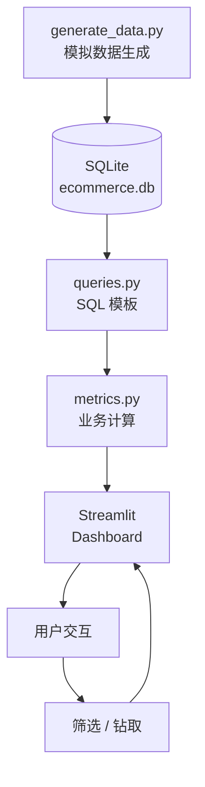

# 项目架构

## 整体设计

## 模块说明

### 数据层（src/generate_data.py）
- 模拟 5 类商品、5000 用户、20000 订单、10万行为
- 幂律分布用户购买力（少数用户贡献大量订单）
- 写入 SQLite（`data/ecommerce.db`）

### ETL 层（src/data_pipeline.py）
- 数据生成（如未存在）
- 数据校验（order_id / user_id 唯一性、孤儿订单检查）
- 时间格式标准化

### 查询层（src/queries.py）
- 预定义 SQL 模板：
  - `SQL_GMV_BY_CATEGORY_MONTH` — 品类月度 GMV
  - `SQL_FUNNEL` — 漏斗各阶段用户数
  - `SQL_RFM` — RFM 分层
  - `SQL_CLV_TOP` — 高价值用户
  - `SQL_REPEAT_PURCHASE_RATE` — 30 天复购率

### 指标层（src/metrics.py）
- `compute_core_kpis()`：GMV / AOV / 订单数 / 用户数
- `get_funnel()`：漏斗 + 转化率
- `get_rfm()`：5×5 分群 + 客户分层
- `predict_clv_simple()`：CLV 预测

### 展示层（dashboard/）
- Streamlit 多页应用
- Plotly 交互式图表
- 4 大模块：CLV / 漏斗 / RFM / 品类 GMV

## 数据流

1. **生成**：`python run_demo.py` → 生成模拟数据到 SQLite
2. **ETL**：`src/data_pipeline.py` 提取、校验、加载
3. **查询**：`metrics.py` 调用 `queries.py` 拿数据
4. **展示**：Streamlit 仪表板消费 metrics

## 业务模块

### 📊 核心 KPI
- GMV（成交总额）
- AOV（客单价）
- 订单数 / 活跃用户

### 🌪 转化漏斗
- 浏览 → 加购 → 结账 → 支付
- 每步转化率

### 👥 RFM 分层
- R（最近一次消费）
- F（消费频次）
- M（消费金额）
- 8 客户分层：冠军 / 忠诚 / 新客 / 高价值流失 / 一般

### 💎 CLV（客户生命周期价值）
- 简单 CLV 预测
- 毛利率折算
- Top 100 高价值用户

## 关键技术决策

| 决策 | 备选 | 选择 | 原因 |
|------|------|------|------|
| 数据库 | PostgreSQL / MySQL | **SQLite** | 单机演示够用，零部署 |
| 仪表板 | Flask / Dash | **Streamlit** | 纯 Python，开发快 |
| 图表 | Matplotlib / ECharts | **Plotly** | 交互式，下钻友好 |
| 数据生成 | Faker / Mockaroo | **自写脚本** | 完全可控，可复现 |
| 分层策略 | K-Means | **RFM 规则** | 业务可解释，面试常见 |
